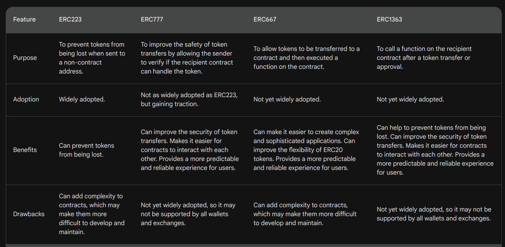

## ERC20 main problem

ERC20 has a lack of important feature.
The main problem is lack of possibility to handle incoming ERC20 transactions, that were performed via `transfer` and `transferFrom` function of ERC20 token.
It can result in the token being lost and **locked for ever**.

The standard ***ERC721*** introduced the concept of Hook with the interface IERC721Receiver.

> A wallet/broker/auction application MUST implement the wallet interface if it will accept safe transfers.

> When transfer is complete, this function
> checks if `_to` is a smart contract (code size > 0). If so, it calls
> `onERC721Received` on `_to` and throws if the return value is not
> `bytes4(keccak256("onERC721Received(address,address,uint256,bytes)"))`.

## Proposed solutions to ERC20 short comings

Several ERC were created to solve this problem, such as:

 **ERC223, ERC667, ERC1155, ERC777, ERC1363** (and many others but here are the most discussed and commonly found).

#### Non Final ERCs

- [ERC223](https://eips.ethereum.org/EIPS/eip-223  "ERC223-EIPS-REVIEW")
    - [ERC223_issues](https://github.com/ethereum/EIPs/issues/223 "ERC223 issues")
- [ERC667](https://github.com/ethereum/EIPs/issues/677  "ERC667-NOT AN EIP") *ERC667 is not an EIP*

#### Final but not retrocompatible with ERC20
- [ERC1155](https://github.com/ethereum/EIPs/blob/master/EIPS/eip-1155.md  "ERC1155- FINAL")

#### Final and compatible with ERC20

- [ERC777](https://eips.ethereum.org/EIPS/eip-777 "ERC777-EIPS-FINAL")
- [ERC1363](https://eips.ethereum.org/EIPS/eip-777 "ERC1363-EIPS-FINAL") 

*Here is a comparison table made by Bard AI*:

## ERC777

## ERC1363
