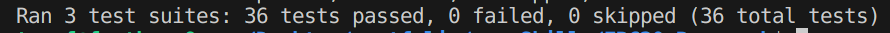
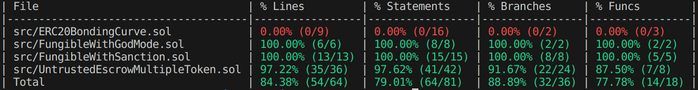

# ERC20 research

- What is ERC20
- Why is it revolutionnary:

  <Before ERC20, tokens had their own set of functions and parameters. That made it hard for adoption and uniformisation>

- What are some of its short comings
 
  *If ERC20 was a big game changer, as one of the first standardisation of tokens there are a lot of **problems and lack of features** that could not be foreseen and that were address by later standards.*

  - ERC20 **lack of callback** to notify a receiving contract is a *big problem* even today and many developers are still trying to bring solutions to it.

  - The approval race is a security issue than needs to be carefully addressed by developers when using ERC20

 [ERC20_Problems and shortcomings](./Research_Papers/ERC20_PROBLEMS.md)

- What are possible solutions ?

    *To address those problems several solutions were built and are still being proposed such as wrapper libraries, extensions or new standards*:
    - ERC223
    - ERC777
    - ERC1363
    - SafeERC20

## directory tree tour:

- Contracts (`./src/`)
  - [Fungible with Sanction](./src/FungibleWithSanction.sol)
  - [Fungible with God mode](./src/FungibleWithGodMode.sol)
  - [Token sale with linear Bonding Curve](./src/ERC20BondingCurve.sol)
  - [Escrow for ERC20 token](./src/UntrustedEscrowMultipleToken.sol)

- Research papers (`./Research_Papers`):
  - [ERC20_Problems](./Research_Papers/ERC20_PROBLEMS.md)
  - [ERC1363](./Research_Papers/ERC1363.md)
  - [ERC777](./Research_Papers/ERC777.md)
  - [SafeERC20](./Research_Papers/SafeERC20.md)
______________________________

### test & coverage

*using foundry and slither tools* 

**test**

`forge test`

**coverage**

`forge coverage`

