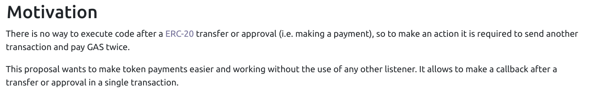

# ERC1363

The ERC1363 is a standard created to solve ERC20 shortcomings.

It is an EIP in **FINAL** state, however is adoption is still low.

## What it solves

It allows for a callback and approve & send in the one transaction, for added security and cheaper interaction.

### Pros

- Enable interaction upon reception
- ERC20 compatible
- Use of ERC165
- Check if a contract can receive and handle ERC1363 with IERC1363Receiver
- Not very complex and not as complex as ERC777 //TODO: link to ERC777 paper

### Cons

- adds a layer of complexity over ERC20
- Not widely adopted