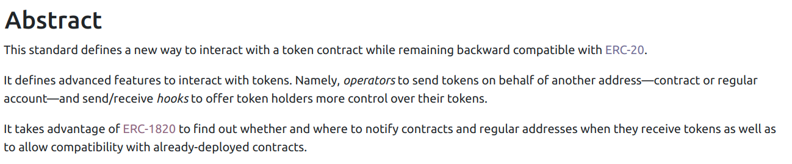

# ERC777

The ERC777 is a standard created to solve ERC20 shortcomings.

It is an EIP in **FINAL** state, however is adoption is still low.

## What it solves

It allows for a callback and approve & send in the one transaction, for cheaper interaction.

### Pros

- Hooks
- notifying receiving contracts
- ERC20 backaward compatible. It can be used where ever an ERC20 can be used.
- Check if a contract can receive ERC777 tokens and allow to handle both cases.
- native burn functionnality

### Cons

- possible **reentrancy** if not handled correctly
- adds several layers of complexity (even more with ERC1820)
- Not widely adopted